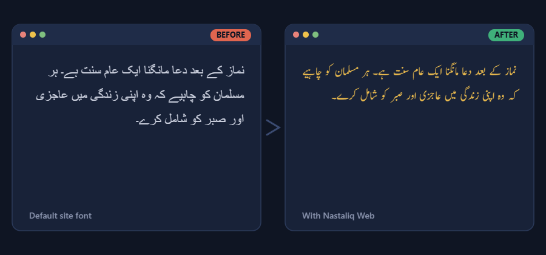

  

<h1 align="center">Nastaliq Web</h1>

**Nastaliq Web** is a Chrome extension that re-renders Urdu text on any webpage in a proper Nastaliq typeface, instead of whatever default font the site ships with — no more squashed, hard-to-read Urdu on sites that only bother styling English.

- [What it does](#what-it-does)
- [Install](#install)
- [Using it](#using-it)
- [Credits](#credits)

## What it does

Most websites either serve Urdu in a flat, hard-to-read font or don't style it for Urdu at all — especially outside Pakistan/India-focused sites, or on Linux where the system's default Urdu fonts are often poor. Nastaliq Web scans every page you visit for Urdu text — regardless of how the page is marked up — and swaps in a font you actually want to read.

- **Detects Urdu by content, not markup.** It checks for actual Arabic-script Unicode characters rather than relying on `dir="rtl"` or other DOM hints, so it works even on pages that don't bother marking Urdu text as Urdu.
- **Only touches the Urdu, not the rest of the tag.** If a paragraph mixes Urdu and English in the same element, only the Urdu run gets the new font — English text next to it keeps its original font instead of getting dragged along.
- **Keeps working as the page changes.** Once a page finishes loading, the extension keeps watching for content added dynamically (infinite scroll, AJAX-loaded posts, etc.) and re-applies the font without a refresh.
- **Font choice.** Four curated fonts — Jameel Noori Nastaleeq (default), Mehr Nastaliq Web, Jameel Noori Kasheeda, and Nafees Web Naskh.
- **Size and line height controls.** Type an exact percentage or use the +/− steppers. A sync toggle keeps the two moving together, or lets you set them independently.
- **Remembers your settings.** Once you set a font, size, and line height, they persist — no reconfiguring per session.

## Install

Nastaliq Web isn't on the Chrome Web Store yet, so for now it installs the same way any unpacked extension does:

1. Download the latest release: **[Releases → nastaliq-web.zip](https://github.com/UMA1R-01/nastaliq-web/releases/latest)**
2. Unzip it somewhere you'll keep it (don't delete the folder afterwards — Chrome loads the extension directly from it).
3. Open `chrome://extensions` in Chrome.
4. Turn on **Developer mode** (top-right toggle).
5. Click **Load unpacked** and select the unzipped folder.

That's it — the Nastaliq Web icon should appear in your toolbar, and Urdu text on any page you visit will switch to the default font automatically.

## Using it

Click the toolbar icon to open the popup:

- **Enabled/Disabled** — turn the extension on or off entirely.
- **Font Size / Line Height** — type a percentage directly, or use the +/− buttons. Toggle **Sync sizes** to move both together, or turn it off to set them independently.
- **Font list** — pick whichever of the four bundled fonts reads best to you.

Changes apply immediately to the page you're viewing.

## Known fonts included

| Font | Style |
|---|---|
| Jameel Noori Nastaleeq (default) | Classic Nastaleeq, Pakistan's most widely used Urdu font |
| Mehr Nastaliq Web | Modern, web-optimized Nastaliq |
| Jameel Noori Kasheeda | Elongated/stylized Nastaleeq variant |
| Nafees Web Naskh | Naskh-style, more upright and book-like |

## License

Released under the [MIT License](LICENSE).

## Credits

Nastaliq Web started as a fork of [Tahajji](https://github.com/simptive/tahajji) by [Yasir Mahmood](https://github.com/simptive), rebuilt from scratch with its own branding, a rewritten detection/rendering engine, and a curated font set. Full credit to the original project for the groundwork this builds on.
